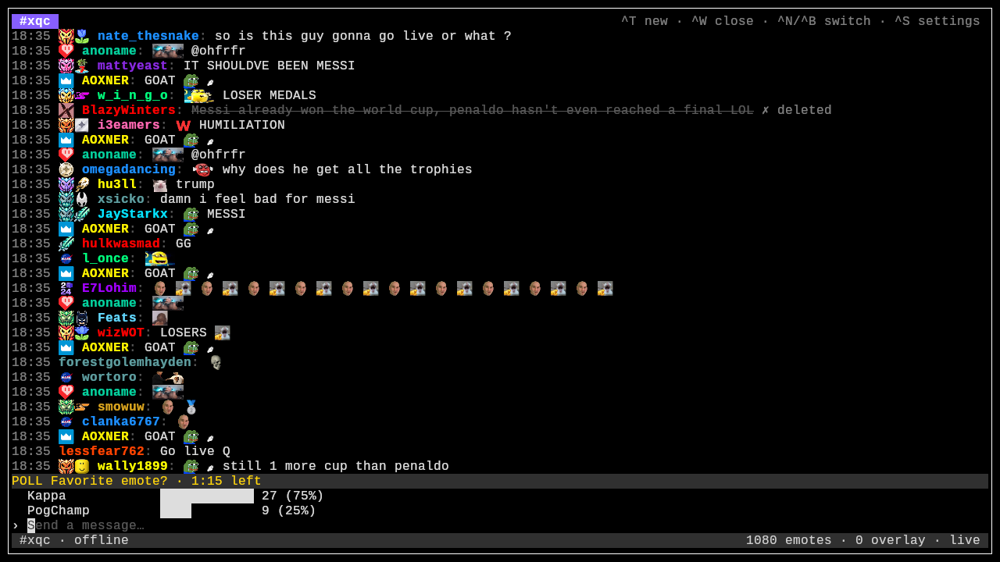
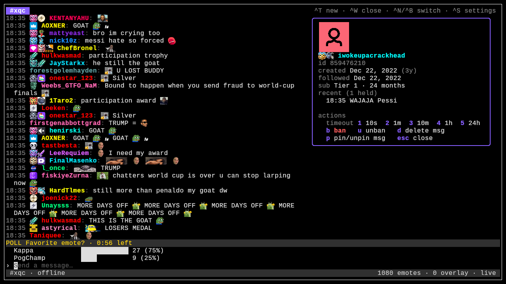
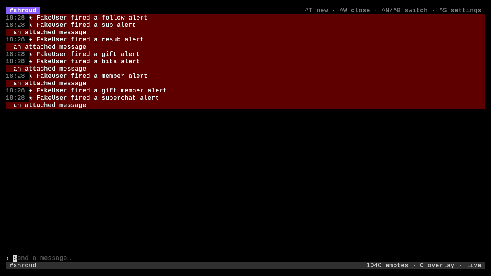
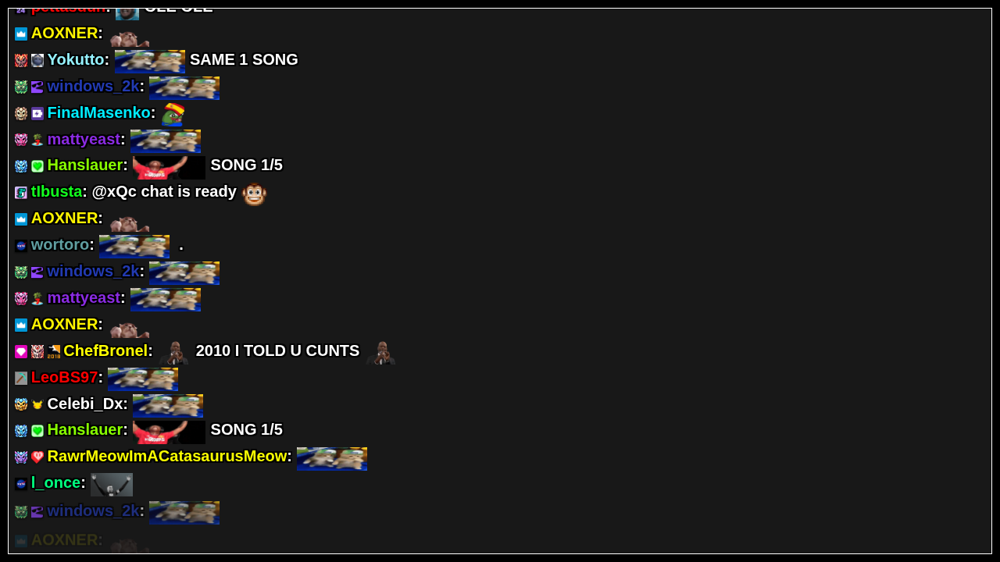
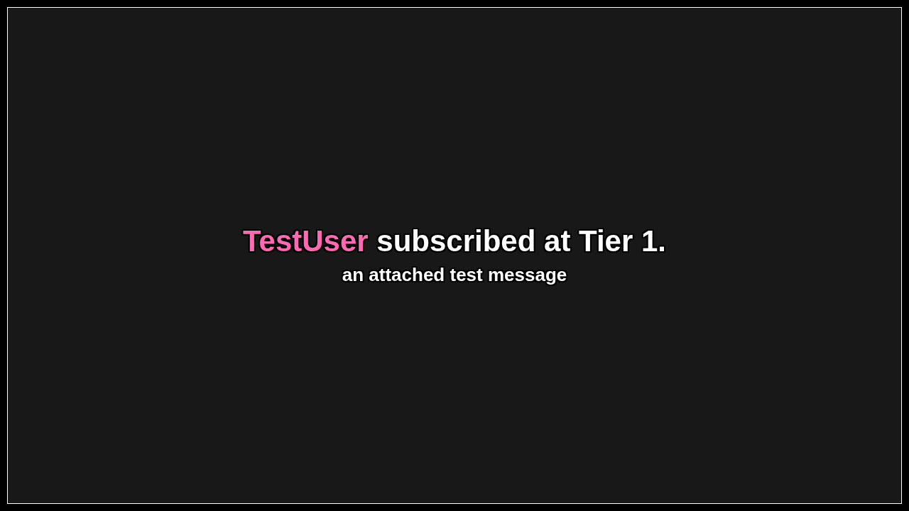

# Crow

A terminal chat client for live streaming — Twitch and YouTube — with built-in
OBS overlays for chat and stream alerts.

Three things in one binary:

- **A TUI** for reading, sending and moderating chat, with tabs for multiple
  channels. Click a username for a moderation card, click an emote for a
  preview, Tab-complete names and emotes, type `/commands`.
- **A chat overlay** at `http://127.0.0.1:7788` to point an OBS browser
  source at, rendering chat on stream with a transparent background.
- **An alerts overlay** at `http://127.0.0.1:7788/alerts` (a second browser
  source) popping follows, subs, bits, members and superchats.

Emotes from 7TV, BetterTTV and FrankerFaceZ render everywhere — as images in
the overlay, and inline in the TUI on terminals that speak the kitty graphics
protocol (kitty, ghostty, WezTerm).


*Chat with inline badges and emotes, and a `/poll` running — the block updates
live and shows the final numbers when it closes.*

|  |  |
|---|---|
| *Click a name: account info, recent messages, mod actions, `p` to pin.* | *Alerts (follows, subs, bits, members, superchats) highlighted in the feed.* |

The two OBS browser sources (shown here on a dark preview background,
`?bg=<color>`; they're transparent in OBS):

|  |  |
|---|---|
| *Chat overlay.* | *Alerts overlay.* |

## Features

- Twitch IRC (tags, badges, emotes, reconnect) and YouTube live chat
  (cookie or OAuth auth), including combined tabs merging both
- Sending messages, with Tab completion for chatter names (`@name`) and
  third-party emote names
- Slash commands: `/timeout /ban /unban /delete`, chat modes
  (`/slow /followers /emoteonly /uniquechat` + `off` variants), `/announce
  /poll /prediction /raid`, `/vip /mod` — see `/help`
- Moderation card on click: timeouts, ban/unban, delete, account info, and
  `p` to pin the message (a fixed row in the TUI, and Twitch's real chat pin
  where the API allows)
- Stream alerts — Twitch follows/subs/gifts/bits, YouTube
  members/gift-memberships/superchats — on the alerts overlay and highlighted
  in the chat feed, along with messages that mention you
- Live viewer count and uptime in the status bar
- Settings menu (`Ctrl+S`): overlay options, alert toggles, chat scale,
  YouTube cookie login, test alerts

## Channels and tabs

```sh
crow -channel yourname                  # one Twitch channel
crow -channel a,b,c                     # three tabs
crow -channel yt:@handle                # YouTube (@handle, channel ID, or URL)
crow -channel 'yourname+yt:@handle'     # one combined tab, both chats merged
```

Tabs: `Ctrl+T` new, `Ctrl+W` close, `Ctrl+N`/`Ctrl+B` (or `Ctrl+←`/`→`)
switch, `Ctrl+1`–`9` jump.

## Login

Reading chat and the overlays need no login. Sending and moderating do.

```sh
crow login             # Twitch device-code flow: approve in your browser
crow whoami
crow logout
crow login youtube     # optional: YouTube OAuth (or paste cookies in Ctrl+S)
```

Tokens are stored owner-only under your OS config dir (`~/.config/crow` on
Linux, `~/Library/Application Support/crow` on macOS). Twitch expires the
refresh token after 30 days idle — run `login` again. Adding new scopes (e.g.
after crow gains commands) also needs a `logout`/`login`.

## Keys

When logged in, the input line at the bottom is focused, so letters type.

| Key | Action |
|-----|--------|
| type + `Enter` | send a message, or run a `/command` |
| `Tab` | complete emote/chatter name; again to cycle (`@` for names only) |
| mouse wheel / `PgUp` / `PgDn` / `↑` / `↓` | scroll chat |
| click a username | open the moderation card |
| click an emote | large preview and details |
| `1`–`5` | timeout presets (in the card) |
| `b` / `u` / `d` | ban / unban / delete message (in the card) |
| `p` | pin / unpin the message (in the card) |
| `Esc` | close a popup, or jump back to live |
| `Ctrl+S` | settings |
| `Ctrl+C` | quit |

Not logged in, chat is read-only: `j`/`k`/`g`/`G`/`PgUp`/`PgDn` scroll and
`q` quits.

## Install

Requires Go 1.26+.

```sh
go install github.com/Nyxnix/crow/cmd/crow@latest
crow -channel <name>
```

Then add OBS browser sources for `http://127.0.0.1:7788` (chat) and
`http://127.0.0.1:7788/alerts` (alerts). `-headless` runs the overlay server
without the TUI.

## License

MIT
